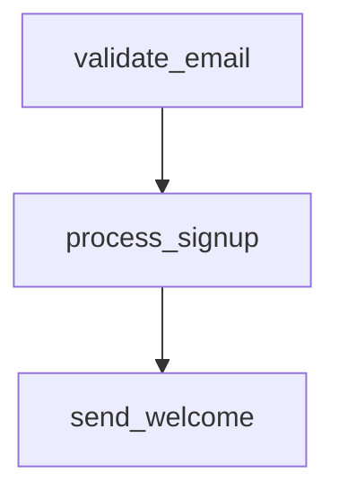

# Skill Composition and Dependencies

This guide covers skill composition - detecting when skills call other skills and managing dependency graphs.

## Overview

Skills can compose by calling `execute_skill()` to reuse other saved skills. The library automatically:
- Detects skill dependencies from code
- Builds dependency graphs
- Warns about circular dependencies
- Tracks which skills depend on each other

## Automatic Dependency Detection

When you save a skill, the library scans code for these patterns:

```python
# Pattern 1: execute_skill calls
execute_skill("skill_name", inputs)

# Pattern 2: get_skill/load_skill calls
get_skill("skill_name")
load_skill("skill_name")
```

Example:
```python
from orchestrator.execution import save_skill

# Base skill (no dependencies)
save_skill(
    'validate_email',
    'def validate(email): ...',
    description='Email validator'
)

# Composite skill (depends on validate_email)
save_skill(
    'process_signup',
    '''
from orchestrator import execute_skill

def process(email, name):
    # Reuse email validation skill
    valid = execute_skill("validate_email", {"email": email})
    if not valid:
        raise ValueError("Invalid email")
    return {"email": email, "name": name}
    ''',
    description='Process signup with email validation'
)
```

Dependencies are automatically detected and stored in the skill manifest.

## Viewing the Dependency Graph

### Text Format

```python
from orchestrator.execution import visualize_dependency_graph

print(visualize_dependency_graph("text"))
```

Output:
```
Skill Dependency Graph:

validate_email: (no dependencies)
process_signup:
  ← depends on: validate_email
send_welcome:
  ← depends on: process_signup
```

### Mermaid Diagram

```python
print(visualize_dependency_graph("mermaid"))
```

Output:


You can paste this into any Mermaid-compatible viewer or Markdown renderer.

## Finding Dependents

Find which skills depend on a given skill:

```python
from orchestrator.execution import get_skill_dependents

# Who depends on validate_email?
dependents = get_skill_dependents("validate_email")
print(dependents)  # ['process_signup']
```

This is useful when:
- Updating a skill (know what might break)
- Deprecating a skill (find callers)
- Understanding skill usage patterns

## Full Dependency Graph

Get the raw dependency data:

```python
from orchestrator.execution import get_dependency_graph

graph = get_dependency_graph()
# {'validate_email': [], 'process_signup': ['validate_email'], ...}

for skill, deps in graph.items():
    print(f"{skill} depends on: {deps}")
```

## Circular Dependency Detection

The library detects circular dependencies and logs a warning:

```python
# This will log a warning but still save
save_skill(
    'skill_a',
    'execute_skill("skill_b", {})',
    description='Calls skill_b'
)

save_skill(
    'skill_b',
    'execute_skill("skill_a", {})',  # Circular!
    description='Calls skill_a'
)
```

Warning:
```
WARNING: Circular dependency detected: skill_a -> skill_b -> skill_a
```

The skill is still saved (warnings don't block), but you should refactor to avoid infinite loops.

## Best Practices

### 1. Keep Dependency Chains Short

Prefer shallow hierarchies (2-3 levels max):

**Good:**
```
base_validator → email_validator → signup_processor
```

**Avoid:**
```
util → base → validator → email → format → check → process → signup
```

### 2. Use Dependencies for Reusability

Extract common logic into base skills:

```python
# Base skill: reusable validation
save_skill('validate_format', '...', description='Generic format validator')

# Specialized skills
save_skill('validate_email', 'execute_skill("validate_format", ...)', ...)
save_skill('validate_phone', 'execute_skill("validate_format", ...)', ...)
```

### 3. Document Assumptions

If a skill depends on others, document requirements:

```python
save_skill(
    'process_order',
    code='...',
    description='Process order (requires validate_payment skill)',
    tags=['commerce', 'payment'],
    metadata={'requires': ['validate_payment']}
)
```

### 4. Version Dependencies

Track which version of a dependency you used:

```python
metadata = {
    'dependencies': {
        'validate_email': {'version': '0.1.0', 'commit': 'a3f8d912'}
    }
}
```

### 5. Test Composition

Before approving a composite skill, test the full chain:

```python
# Test individual skills
result1 = execute_skill("base_skill", test_input)
assert result1 == expected

# Test composite
result2 = execute_skill("composite_skill", test_input)
assert result2 == expected_composite
```

## Troubleshooting

**"Circular dependency detected"**
- Review the dependency chain in the warning message
- Refactor to break the cycle (often by extracting shared logic)

**"Skill not found"**
- Dependency name might be misspelled in code
- Dependency might not be saved yet (save base skills first)

**Deep call stacks**
- Simplify the dependency chain
- Inline small skills instead of composing

## Integration with Orchestrator

The `execute_skill()` method in Orchestrator respects dependencies:

```python
from orchestrator.runtime import Orchestrator

orch = Orchestrator(...)

# Automatically loads and executes dependency chain
result = orch.execute_skill("composite_skill", inputs)
```

Behind the scenes:
1. Load composite_skill code
2. Detect dependencies (e.g., base_skill)
3. Load base_skill code if needed
4. Execute in correct order
5. Return final result

## Related Documentation

- [Skill Library Reference](../reference/SKILL_LIBRARY.md)
- [Executing Skills Guide](EXECUTING_SKILLS.md)
- [Code Validation Guide](CODE_VALIDATION.md)
- [Skill Approval Workflow](SKILL_APPROVAL.md)
